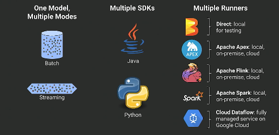

## Learning Apache Beam
# INTRODUCTION

Apache Beam is an OS, portable, unified programming model used to build batch and streaming data parallel processing pipelines. Beam supports Java, Python and Go SDKs. Beam pipeline can be executed on multiple compute engines or runners namely Direct Runner, Apache Flink Runner, Apache Nemo Runner, Apache Samza Runner, Apache Spark Runner, Google Cloud Dataflow Runner, Hazelcast Jet Runner and Twister2 Runner.(runner ref: https://beam.apache.org/documentation/runners/)

# BEAM ABSTRACTIONS

1. Pipeline: A Pipeline encapsulates your entire data processing task, from start to finish. This includes reading input data, transforming that data, and writing output data. All Beam driver programs must create a Pipeline. When you create the Pipeline, you must also specify the execution options that tell the Pipeline where and how to run.

2. PCollection: A PCollection represents a distributed data set that your Beam pipeline operates on. The data set can be bounded, meaning it comes from a fixed source like a file, or unbounded, meaning it comes from a continuously updating source via a subscription or other mechanism. Your pipeline typically creates an initial PCollection by reading data from an external data source, but you can also create a PCollection from in-memory data within your driver program. From there, PCollections are the inputs and outputs for each step in your pipeline.

3. PTransform: A PTransform represents a data processing operation, or a step, in your pipeline. Every PTransform takes one or more PCollection objects as input, performs a processing function that you provide on the elements of that PCollection, and produces zero or more output PCollection objects.

4. I/O transforms: Beam comes with a number of "IOs" - library PTransforms that read or write data to various external storage systems.

